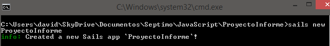
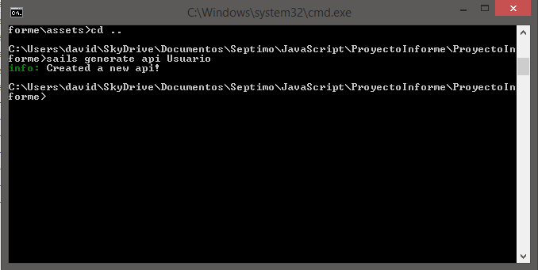
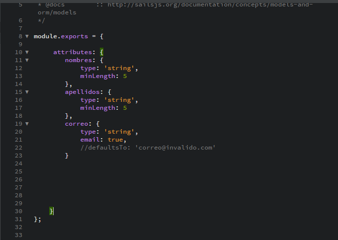
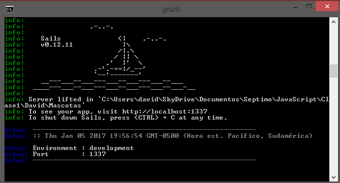
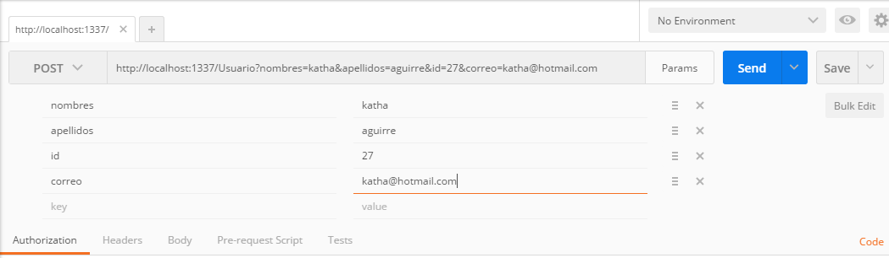
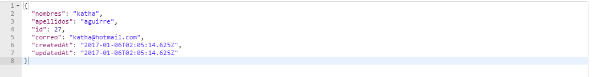
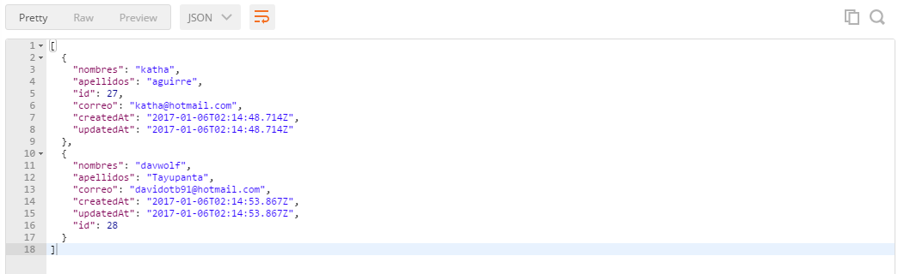

# Sailsjs - Assets / Views / Pipeline / Controllers

### Materia : `Tecnologías Web con JavaScript`

<p align="center">

</p>

### Tema : `Sailsjs - Assets / Views / Pipeline / Controllers` 
### Fecha : `2016-01-05`
### Estudiante : `Vicente Adrian Eguez Sarzosa`
### Profesor : `Tania Calle - Adrian Eguez`
### Número de informe : `8`

<a name="cabecera"></a>
## Índice de contenidos


- <a href="#tema">Tema</a>
- <a href="#objetivos">Objetivos</a>
- <a href="#marco-teorico">Marco Teorico</a>
  * <a href="#sails">Definición de Sailsjs-Assets</a>
  * <a href="#views">Definición de Views</a>
  * <a href="#pipeline">Definición de Pipeline</a>
  * <a href="#controllers">Definición de Controllers</a>
- <a href="#desarrollo">Desarrollo de la Práctica</a>
- <a href="#conrec">Conclusiones y Recomendaciones</a> 

<a name="tema"></a>
## Tema
El tema de la práctica es: `Sailsjs - Assets / Views / Pipeline / Controllers`

<a name="objetivos"></a>
## Objetivos

- Desarrollar el conocimiento Web
- Entender para que sirven las carpetas que sails crea al crear un proyecto su utilidad y funcionamiento
- Entender la funcionalidad y las ventajas de usar un controlador 

<a name="marco-teorico"></a>
## Marco Teorico
<a name="sails"></a>
### Definición de Sails 
***

SailsJS, entre otras cosas, nos facilita en gran medida el desarrollo de APIs REST, servidores de archivos, seguridad y websockets.

Está creado con la filosofía “Convención sobre Configuración” o CoC, por sus siglas en inglés; esto significa que nos permite enfocarnos en el desarrollo de la idea, ahorrándonos mucho tiempo en configuración inicial y es un complemento ideal para frameworks como AngularJS, BackboneJS o ReactJS.

Esto se logra gracias a que SailsJS sigue un conjunto cuidadosamente selecto de convenciones modernas, automatizando una gran parte del proceso de desarrollo.

Un aspecto interesante es lo relativamente cómodo que resulta para casi cualquier programador el adoptar esta tecnología. (Fuente: [Platzi](//https://platzi.com/blog/introduccion-sailsjs/))
<br>


<br><br>
<p align="center">

</p>

<a href="#cabecera">A la cabecera</a>

<a name="views"></a>

### Definción de Views
***

En Sails, las vistas son plantillas de marcado que se compilan en el servidor en páginas HTML. En la mayoría de los casos, las vistas se utilizan como respuesta a una solicitud HTTP entrante. (Fuente: <a href="http://sailsjs.com/documentation/concepts/views">SailsJs.com</a>)
<br>


<br><br>
<p align="center">

</p>

<a href="#cabecera">A la cabecera</a>

<a name="pipeline"></a>

### Definción de Pipeline
***


El archivo pipeline.js en la aplicación Sails determina el orden en el que las hojas de estilo, JavaScript y los archivos de plantilla del lado del cliente deben ser compilados y enlazados como etiquetas script o link (Fuente: <a href="http://sailsjs.com/documentation/anatomy/tasks/pipeline.js">SailsJs.com</a>)
<br>


<br><br>
<p align="center">

</p>

<a href="#cabecera">A la cabecera</a>

<a name="pipeline"></a>

### Definción de Controller
***


Los controladores (en MVC) son los responsables de responder a las solicitudes de un navegador web, una aplicación móvil o cualquier otro sistema capaz de comunicarse con un servidor. A menudo actúan como intermediarios entre sus modelos y vistas. Para muchas aplicaciones, los controladores contendrán la mayor parte de la lógica de negocio de su proyecto (Fuente: <a href="http://sailsjs.com/documentation/concepts/controllers">SailsJs.com</a>)
<br>


<br><br>
<p align="center">
<img src="data:image/png;base64,iVBORw0KGgoAAAANSUhEUgAAAOEAAADhCAMAAAAJbSJIAAABg1BMVEX/0gO5ucNORUb/0gT/jwT/sQD/tAH/1AT/1gSEwudgrt//uQC5ucFPRUaugixBPkjy8ff/zQP/mQRJQkd8ZTv/igT72AC2uMjaxoJGPDzBwcv/4ADWxIzW1t3/lwTrzFB1cHTnwxSzttC0t8uOi5BUSUQ6Nkr40Cbg3+Xp6O7Ptx9NPjiIzPKQfzhPT1NecoBit+ynpa310UL/oQRrkKpYhKRdVlj/xgT+/v/JytH/pgTS1/A/NTOKhoeurbZlYGGYmJ0xMEyjkDLyYES4mSo8N0aEdTswJCCwtdftzA6rn2p9eXpm1//tWkrvMxX4WDPidGz8TyPtOib1LgDaUlLGmyW4na/Ek56RkreSu9rVgX9iVELXqhzRiIzoRzq3iyqEm8XEpazdxFe7pikkHDdiYG/kzDGvn1lrXkOslC0zKzefo70pJ06BiH87YKTEtVSZlm2Nj3o5Yp0iVamlm2+Ik3PYu0BXcJe/tkosKU3HrSbJv6XkymjDaXfQwZg7O1peYH6qzUjAAAAPm0lEQVR4nO2djV/bxhnHLZ1BSpELtuNLJA1qwHVMShocNjtmwhhSSBzWpS1b06xNt4UVkrUsTdtkSV/W/em7506nd9uSLRns6ZfPByzZSPf1c/fc3XP3KJlMqlSpUqVKlWoKhIjID/uQnTvHEsUtlJEQspAAFknSVBFmpFcYIZkfyYTt2ivpPAsUu+SbzzE+xTKWZZm80GV88oM8+M8mSPq33z/vfvf8xcv7L17efP3d6/tnr+9PFaH84uzlv/WzV6f62Zne/eGFfvry2/vyNLXD7r/Obur45smZfvOs+/x0++Tb1y+ni1Dqfn8iSU9On7w8eXF6H58+/+H5k1fSNBEiqXuGkQRu5gzLGRk0Zb1FRpJNIDkzXWC2eH+PppeQ/55WwFSpUqVKlSpVqlSpUvXWlM0DkC8KPV1h6QzK++IK0nSFUkqlvKdWys0ZPD1mlPKl0pwrzo7kZqk0K08xIQHMZktzUxPV9BAiJM8RQIo4JR6VEdorfCYgs+JUIAJh0yYEwNJWNrtVmpqKKjVdhHlCNgvQs+RFfhoJM6TOYjiFZ0gvMhVrmZTQPkRSXmbQcnM6AE1CR3Uk9mRmlaYD0E+Y4YTnVqSY5W2HUFF90JOsAIOZp86tSDHr/4CwVy2dZsLM1BMiaW5aOntQgOOcfsIMeJpp6SuCbUiMOCXNkMx2Zd7jy67NZhKNv3FN8CYDaSmbh6BMU84XtpyIBAvrOjEwknQdTy4gaW/ZEiKEeZgVOn0Lysh7uXkIY3T3xb0JRpQ3s9kscZxN8qtg2RDqpbT8RqweyzI+rorfdCWE/FHjyRBFpNqU+c6lDN2mjIti8eD68fXLRXFen9y9y8TVbFqAfC+23F3GpBU+FcVidb9KQJ/qMsLXuxMal0JyAcJqm3YVlZarb471Z/tFkau4/4F+/E11eTJnjMSKS9nSFrajiTph2n9aFZ2qfr4vFnP6hBJKcnbL4SwR3iN0RdGn3WeTG1uUnD2hhPS9ecaUK87Pz3PW6p4+me0w410rREi/wajmq5f3nu1drhYtwMkihNJKXmVgu/L1XWrA/RtdHWOsdw+qDHDCAjdkPPZOkJ49O3lKjTZ/eoudkfTjN2/2Js/LyFdXVwL09T/3dymgWuHvr17F0EFOWhWVrq4ogqIIbinaoUrqJxA2NIVr5SqMZ/h4YDJGb2TYueLDo6qLBvUyaocSk2+B/FiR7CYIvctE9PzX7gUTCppCCQ2FAioa/Lh3zUEoNzcnYHaMehMKmkptqNG3Hx49FByEpILCCvjSxc/MCkuoPD56TH7aNkQyTCRnJppQa7FaajZDARqibUMJALfGPXoD5wbJi30lOwQTvVu/X+RqubzpjurwNOwUJ0QUMLul8wtZFw+8Y3zzSZiczhSWbBWCtckF4V9CWGNaXHRa8FA1h6ENzUlIvSeCFXBCaF0o+D5mIbbysZkaoXwpG0VLMhDWdqi2a05CoW6IjNHoaFBDGeEJxvSbjHQf2K0SE6EM1wv6KuGn/a1ammM2bGmglsuGglYu1xswKhXVukb7Q0XQ6uruMZlAQigc7uS+Wo8aA4hxhc3hvoWMHF6sHda2D0Edtw0VAt1hnb6xrREzkuMKOa4ew8ibbpaawYNvQQQbVmIyIrlWKS/5RlM0jusMkblCvEBI5SZUaC+/w5qiKpYrnUpZVHM5JyL4UseVnVe1740yMmsOMRFmI17KXUvd3QaplR3T3ZCqqnLPI+4e62aHXwpjG4QLQBgL4pCEwZ4GCKGW5gKiGMdgO9rlh2hfEOE6Z8LFegfUXvQSarSCqi66efJP3Ic5IukTC2Gc5AWw4SKbGrV8hKTHMA5bh4bIqyox3w392Zs31+Eu0MLC3O0CENZ2GqBDXy1VtHpHUzQFOg3WDn89wRn84zItb9jw/gUgDBzTmFak/gYGNpXDCnGsv96ClRrJ/usQd7gIhJa8hIyyTUY3FegNVfFN9Gg3On9Ps6JxBc4xSF0tG3fbYE/D+O+tC0A4+I5k/mG1oH7zQ0uaxn875/ghlUAtHXApMi/YhE3NEQj5B9xRjJAafztEMLabtT6GCeEAQBchjlqocyCUmmzfNq2p+ACChYMQOamgNQ5w1M0KsDA5Xk9Dt+CbiPhgPwqhojX2D3DEso6B0Ioy8OmMPsfTRHBRdBPC4Ebgxwo7dBGKRUx3L3hlxUjGTkgDG74wxpKJiHNA6KmKHNF+Zb1HCHOUcJNcpBAUvNjKe/uTpAmlnoEN2LTuISRELej4OSFEp5yUnFCa6x3F8IUsEiWEmWopKLABJYFYp5dQ4WMbysUOFD8hQoUeYQv2zblXIWMndF1Kni1lC5K3zcxRQOQjFFrm8I1WUH+M0SREAe2Qa8berZIYofdUCbnCFixfi6bckXYoum24GEC46LahiDOe6zn3vCG8BKF+RyESJkQus7JyMEC2DEhsKDp96YIpcKL2gcOXirSWuuUqPOzK8ZZhfITmqYKdi0YIjboQmhCCqH5CdxkuAKHULFjJdmBDUdD8hL4DkCaIQTYcN6HrDGI3dF/dsbCJYR1b3a6b6qwxLdCjBfOow9/ehml+cQIIHZtKMFupJzJAd03fUoMzas08ukvfU3k8cRII7fADtmJoOSLR4IT0FCc02Jtc50TIugHW6JwX60HIhd17unoRunRehBksmwZz7dyKSFhbozGpBXq0QF+v1WIgHDwxHygy6duU6aXkuaWmvWMiKqHpPo2cmDPM11EIEbuhe9gWjw2hgm5icnUdBsX2BsNohOrhbWC63QYoo80ODtWQhHT3CaYtxZmRGZenyZOh5tZWdomNyELb0F140v3fJmoZ4FdyRgsO6h4T9iFEM3N0LY2AztkrhnG1Q3uWRIMwPM4UzYYEsdHp7HAmY6fTaXgBexPKM5AavQVVKFsqWI2REY682Y8tBTFAxy7fQa3cRwidY6+DQYQwayw1wYZZ927xWDyNuaDnefzBMIQD1buW0mcwLNHvuWDFK+MizPBlWXiEhbs/7NcGhiDsN2qD2agJaD+FNS5CeqlmqemdAfe9OsIB658DlOsXa8MzFLHg3KIZGyGMZSTkG2Xnt5q9A5wI7+0Wo2l3rx8hkgFx07UHFfm7yFglyT0WomFfUz4vf3A5mj6QyV/12eREEDex5yk+m6WYamk0IWl2hmguquCPZvusQMmzsmtkDPuYtkbdpenbht5DbkI0MzusZvpYBEluQOrmR9ppizLSk6uh9LPrsV1IpjYcSrOBawcD1ryHrqfStSsrV0Jp9d7PTjPSdjicgk2CBlSmYRGlK4ISUsI95xLu8FkTPf5S7i73U5c54ajrOkj6edUs/kCRz/yU0NZzOv/+cbfaT9DPRN/fTwh/c4UuEQmhlsiUxDb1ShJ+VxTf662cWJXB20Wuq0CoaB8ehbNhEoRQZOkW8WSi+P7v3PqtQ1/l5sln3oncbSBG+NEnYSyYkA2Jh/nPvdUrV8Tc+xtvObWx7tDN91Ti7VZ+iorICBUt5EJuMjaUrq7QiL+X8JJD6zdVlRRRuRIVkREK/rSeMRJSdy6EIiT/ViJu52CeJrSS8TTXVgXBQ7ixsQGE6+s2YU6lm8hW3pk4QhRE+Msvn21cuvTo8eNHfsJoPZaLUBHasLygKK4j+trsM5VEclz8hBt/Ovpk49L6Rw/urLsJldEIBaFiMRG16ZG5AMp2rrUS6fEDbPi3o6PP1h99/ODTdY+nGdWGFfM3A2zDr0W6dsYj9IlMRIPa4Yd//PAPf7FNGJMNgVCxLUgBGWFrcZHtIB0X4VufHT34+uMHDxMkBED6mhOKDbFTGx/hxpd3Htx54Owt4ibstAXFRdhW2q0x2nDjUwL4eN1BGFc79M0zOCG4oDESvrV+58HHj5KyYSBhY2dnnLXUNaCJm5BtgFE8hCzfYGyElxInJCPhWtvZDjudzjhrqZ8wvnZoEmq1VqftINwZby1N3oYEEPypoHBCMsFKtJZCWoZN6AVMgBA23NEegxOWy+V6gjZUOnXRGcVQvcqJagcKFGM7VNyECY9p2p1OTrXWG1VV9CECYT1GQrPXN2uptc8wAT6zltbr5UGCScGIhEoF+vsgQiHp2ZPCpy99RGvWiLOnjuAgVGxfas0PE3mOBfOloWLSkW2IvHN82NBkb3lt1TzpWooc9/+qApdjvjScIttQxv4ohuJomJ4YldKN+8GH5DvGJ1EIV58EZCz0Fj6uVlzDUEVxPk7HH+//B+S8xEqYwZ/va0JoKdpXueWwbYV8fd1dtRIunm9e34As5VgJ8cF8IwKhoJWL74Z+GhqSrlejEQpG8UbUrJ4BZdBzYkRCsRq6qQQSOu+maN52mADhuyahuTpEh4zcmwdEqilhWGfjJTRTXkxfqpgHrnskRqgofzcdGx1dtEwnp8GBa8mBEob1BT5CpeXM5/WlSyRJKDw8+oiZzs5DITM4duBEHInQgmo5D7TxELa/fEg5eNoN/coDUqhHs6EVFoVzrZovqyfBdkgqpOIw4WJNsNOo3Gk3UQnFQ0dWj3abbetdo7fie3wdhPVECFX29bKul2dp0MEiP3AnFkUkNDR7TKgtWITk+7MIeb+vtHbERAgrmpmZSX6sWYTklE3IB6ZaXY1KKDasbHKhZdmQnPLYEAb3h2oihPCgJY0VQnPYUNO8aTfkQ20yg4xKKKrliqnOmvn8h21y0DYfBqHwdw/hMSWJEIpqg99k23wGxVoHjswi1Pi7FfoAsciE9nS6sWa6z7uqalRMT1M3rFm2mBShXYa7pi+tNSARh3saVxGGILS0wwkNeCgnJ3TtZE6KkMvghPAAJpUTqq59rKMQ1pyEixeI0PWZUQjNdDNI5FE75sGYCRfN9DdKyNPfYiNUTV+qwBV32MHt7fES8h4CKibPwfGk3YxAyNNczG+T9Rx3XR9JmlBssCLQRBSeg3MYmw0J4sLt22vmMx1pzsui+wPJE6rlNSvTJmdsk/IsbHuyUkYhFA2xbKW8iEbjcMeb8pI4oagaO2WR31ZVy2VfWspIhH558g2SJxysmAk9SgnHQxgqikEzSJbZY+FDSxT392J85DiUQf+8GKkAlDDUXmHCl8ngg935SNqf746wpzygDJJ8PWIR5nef4UyYvcJIyjebzfyf346kvzZBce39khAU4YtoRXj7C1rwEE0xTzMfZiOmvLBEmbgWaOjVhipCv6QUrubwOS9xPddXGiHtZvB/MIzQ8Dkv+XgAM1Jz6CKEqEbwhMahFRNh6IyroCKE8AXBz8EJobj4aPZMkmUYf0ZfjJrowqdKlSpVqlSpUqVKlSpVqlSpUqVKlSpVqlSpUqVKlSpVqlSpUqVKlSrVIP0PRN3b42UD+toAAAAASUVORK5CYII=" width="300" height="200">
</p>

<a href="#cabecera">A la cabecera</a>


<a name="desarrollo"></a>
## Desarrollo del informe

### Instalar Sails

Para instalar Sails en nuestro computador lo unico que debemos hacer es ingresar en una consola el siguiente comando:

```
npm install -g sails

```
### Instalar Sails

Para instalar Sails en nuestro computador lo unico que debemos hacer es ingresar en una consola el siguiente comando:

```
npm install -g sails
```
### Crear un Proyecto

Para crear un proyecto abrimos una terminal desde la carpeta en la cual queremos crear el proyecto y en esta ejecutamos el siguiente comando 

```
sails new NombreDel proyecto 
```
<br><br>
 Si la creación fue exitosa se muestra en la consola algo así:
 <br><br>
<p align="center">

</p>

### Crear un Api

Una Api es la fusión de un controlador el cual se crea ejecutando: 

```
sails generate controller NombreControlador 
```
<br>
y un Modelo el cual se crea ejecutando:
```
sails generate model NombreModelo  
```

y finalmente si lo que queremos es crear una api utilizamos el código:
```
sails generate api NombreAP 
```
<br><br>
 Si la creación fue exitosa se muestra en la consola algo así:
 <br><br>
<p align="center">

</p>

### Código en el modelo


Nos dirgimos al directori: api/models/"nombre del modelo que creamos" y ahi agregamos el código siguiente:
 <br><br>
<p align="center">

</p>


Ahora inicializamos el servidor para ello en la terminal ejecutamos el comando:
```
sails lift  
```

 <br><br>
 Si la ejecución es correcta se mostrará en consola algo asi:
 
<p align="center">

</p>

Ahora en Postman ingresamos los siguientes parametros en el metodo post:
<p align="center">

</p>

Damos click en send y si todo fue correcto  se agregará el registro:
<p align="center">

</p>

Para visualizar todos los registos que hemos creado usamos el metodo get:
<p align="center">

</p>

  <a name="conrec"></a>

<br>
<a href="#cabecera">A la cabecera</a>

## Conclusiones y Recomendaciones

- Se recomienda usar vistas para evitar que se recargue toda la página.
- Es importante concer la teoria de modelo vista controlador para entender el funcionamiento de Sails
- Sails nos permite gestionar nuestras aplicaciones web de una manera muy sencilla

<br>
<a href="#cabecera">A la cabecera</a>


# ¡Gracias por su atención!

Author: [David Tayupanta](https://github.com/davidotb91)